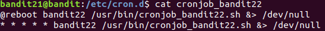

# Bandit OverTheWire

Date: Jun 10, 2020
Progress: approved
Tags: UNIX, bandit, practical, week1

# Bandit 0

```bash
ssh bandit@bandit.labs.overthewire.org -p 2220
```

# Bandit 0 → Bandit 1

```bash
cat readme
```

# Bandit 1 → Bandit 2

- To access file with names starting with (-) hyphen, you need to provide the full directory
- Following command reads the content of a file named **-**

```bash
cat ~/-
# another way is to use 
# rev - | rev
# since this command does not interpret - as special charater
```

# Bandit 2 → Bandit 3

- To access files with spaces in their names use a backslash `\` before every space
- You can also use "Tab" button for auto-completion of filenames
- To access the contents of a file with the name **`spaces in this filename`**

```bash
cat spaces\ in\ this\ filename
# another way is to use double quotes
# cat "spaces in this filename"
```

- Password: `UmHadQclWmgdLOKQ3YNgjWxGoRMb5luK`

# Bandit 3 → Bandit 4

- list all the files (including the hidden ones) and access the file with `cat`

```bash
ls -a
cat .hidden
```

- Password: `pIwrPrtPN36QITSp3EQaw936yaFoFgAB`

# Bandit 4 → Bandit 5

- Check for ASCII text file types inside the `~/inhere` directory using `file` command

```bash
file ./inhere/*
```

- Password: `koReBOKuIDDepwhWk7jZC0RTdopnAYKh`

# Bandit 5 → Bandit 6

- Change directory into inhere
- For all directories inside inhere, check for files of size 1033 bytes and no permission to execute

```bash
find /inhere -type f -size 1033c
```

- Password: `DXjZPULLxYr17uwoI01bNLQbtFemEgo7`

# Bandit 6→ Bandit 7

- Use find command with flags like -user, -group, -size

```bash
find / -user bandit7 -group bandit6 -size 33c -type f
```

- The file with permission to read for bandit6 user is: `/var/lib/dpkg/info/bandit7.password`
- Password: `HKBPTKQnIay4Fw76bEy8PVxKEDQRKTzs`

# Bandit 7 → Bandit 8

- So the password in the file data.txt starts with the word millionth, use command `awk` to search for the pattern

```bash
awk '/^millionth/{print}' data.txt
```

- Password: `cvX2JJa4CFALtqS87jk27qwqGhBM9plV`

# Bandit 8 → Bandit 9

- The `uniq -c` command counts the number of  immediately occurring
- Say file.txt has a string "aabc" the command `uniq -c file.txt` will give a count as: 2 a, 1 b, 1 a
- But what we actually need is a count that looks like: 3 a, 1 b. For which we can group all the a's together using the `sort` command

```bash
sort data.txt | uniq -c
```

- Password: `UsvVyFSfZZWbi6wgC7dAFyFuR6jQQUhR`

# Bandit 9 → Bandit 10

- `strings` command extracts strings of printable characters from a file

```bash
strings data.txt
```

- Password: `truKLdjsbJ5g7yyJ2X2R0o3a5HQJFuLk`

# Bandit 10 → Bandit 11

- While `base64` command encodes any text `base64 -d` decodes them

```bash
cat data.txt | base64 -d
```

- Password: `IFukwKGsFW8MOq3IRFqrxE1hxTNEbUPR`

# Bandit 11 → Bandit 12

- The command `tr` is used to translate characters as: `tr [OPTION] SET1 [SET2]`

```bash
cat data.txt | tr '[A-Z][a-z]' '[N-ZA-M][n-za-m]'
```

- Password `5Te8Y4drgCRfCx8ugdwuEX8KFC6k2EUu`

# Bandit 12 →Bandit 13

- Hex dumps are basically hexadecimal representation of a binary file (looks something like opcode)
- `xxd` command dumps a data in hex dump format and `xxd-r` reverses the dumping process, i.e files are changed back to binary

```bash
cat data.txt |xxd -r > /tmp/rachu/file1 
```

- Assuming that you already have made a directory /tmp/rachu, the above command saves the binary file as file1
- Since file1 is a compressed file in itself we check the extension  type or file type as follows

```bash
file file1
```

- Based on the compression type rename file1 into a file name with extension type and Unzip the renamed file.

```bash

# For gzip files
mv file1 1.gz
gunzip 1.gz

# For bzip2 files
mv file1 1.bz2
binzip2 1.bz2

# For PSIX tar archives
mv file1 1.tar
tar -xvf 1.tar

```

- Repeat the above step to several times only to discover a text file with password
- Password: `8ZjyCRiBWFYkneahHwxCv3wb2a1ORpYL`

# Bandit 13 → Bandit 14

- We can use ssh private keys to login in a remote machine

```bash
ssh -i sshkey.private bandit14@localhost
```

# Bandit 14 → Bandit 15

- Use Netcat or `nc <ip> <port> < file`  command to send data over a TCP connection

```bash
nc localhost 30000 < /etc/bandit_pass/bandit14
# Another way to use nc command
cat /etc/bandit_pass/bandit14 | nc localhost 30000
```

Password: `BfMYroe26WYalil77FoDi9qh59eK5xNr`

# Bandit 15 → Bandit 16

- The aim is to get the password from a server, for which we  need to establish ourselves as a client.
- s_client implements a generic SSL/TLS client which can establish
a transparent connection to a remote server speaking SSL/TLS
- The following command should prompt you to an input. This is where we provide the password

```bash
openssl s_client -connect localhost:30001
```

- Password: `cluFn7wTiGryunymYOu4RcffSxQluehd`

# Bandit 16 → Bandit 17

- `nmap` or 'Network Mapper" is a network exploration toolq
- `-sc` Performs a script scan using the default set of scripts.
- `-sv` enables version detection

```bash
nmap -sC -sV -p31000-32000 [localhost](http://localhost)
```

- It seems like the port `31790` is listening and speaks ssl. the following command prompts for the current password only to output a private key, which we need to login into bandit17

```bash
openssl s_client -connect localhost:31790 > /tmp/key
```

- Ssh-ing into bandit17 is not permitted just yet. We need to make sure that the file containing the private key can be read or written to ONLY by us.

```bash
chmod 600 /tmp/key
ssh -i /tmp/key bandit17@localhost
```

# Bandit 17 → Bandit 18

```bash
diff passwords.old passwords.new
```

- Password: `kfBf3eYk5BPBRzwjqutbbfE887SVc5Yd`

# Bandit 18 → Bandite 19

- `-t` allocates pesudo terminal. Meaning, it allows us to write a command to execute on ssh-ed remote machie

```bash
ssh bandit18@localhost -t  cat readme
```

- Password: `IueksS7Ubh8G3DCwVzrTd8rAVOwq3M5x`

# Bandit 19 →Bandit 20

- `setuid`  or Set User Id is a process (NOT a command) that allows a user to execute a file or program with the permission of the owner of that file
- In our case, bandit20-do is a binary file provided to us such that any command-line arguments with this binary file is executed as if the execution is being done by the user-id being set by the binary. So in the following code it is as if the `cat` command is being executed by bandit20

```bash
./bandit20-do cat /etc/bandit_pass/bandit20
```

- Password: `GbKksEFF4yrVs6il55v6gwY5aVje5f0j`

# Bandit 20 →Bandit 21

- `./suconnect` sends the password of the current level to any port we specify in the command line along with it. But we need to make sure that the specified port is listening.
- `nc` command with flags for numeric input, listening mode, verbose and port can be used to make a port listen

```bash
nc -nlvp 65000 < /etc/bandit_pass/bandit20
./suconnect 65000
```

- Password: `gE269g2h3mw3pwgrj0Ha9Uoqen1c9DGr`

# Bandit 21 → Bandit 22

- Cron is used to schedule commands at a specific time like scheduled backups, deletiing files, monitoring disk space, etc. These scheduled commands or tasks are known as “Cron Jobs”
- The cronjob_bandit22 located at the directory `/etc/cron.d` contains the following information.



- The content of the file cronjob_bandit22 reveals a command to execute a file `/usr/bin/cronjob_bandit22.sh` in the background at every reboot of the user bandit22 and outputs to  `/dev/null`
- Let's find out what the directory `/usr/bin/cronjob_bandit22.sh` has in store for us:

```bash
cat /usr/bin/cronjob_bandit22.sh
```


- So, at every reboot the permissions of the file `/tmp/t7O6lds9S0RqQh9aMcz6ShpAoZKF7fgv` is set to 644 and the bandit22 user password is saved to it.
- Now we know where to search for our password!

```bash
cat /tmp/t7O6lds9S0RqQh9aMcz6ShpAoZKF7fgv
```

- Password: `Yk7owGAcWjwMVRwrTesJEwB7WVOiILLI`

# Bandit 22 → Bandit 23

- `md5sum` is a command that for a file or text, creates a cryptographic hash which can be used to check for modifications in the file and verify their authenticity.
- `cut` command alone splits sections from each line while `cut -d ' ' -f 1` splits text  based on the delimiter `' '` <space> and chooses the first portion of the text
- The cronjob_bandit23 located at the directory `/etc/cron.d` contains the following information.


- Much like the previous level, the command executes a file `/usr/bin/cronjob_bandit23.sh` in the background at every reboot of the user bandit23 and outputs to  `/dev/null`
- What does `/usr/bin/cronjob_bandit23.sh` contain, you ask?


- As indicated by the hash-shebang (#!), the content is a script to be run on bash. The script has two variables: `myname` (assigned with the current username) and `mytarget` (assigned with a command line to create a cryptographic hash of a string)
- The script executes the command in the variable `mytarget` to create file in `/tmp` and copies the password for user `myname`.


- So if we replace the variable `myname` with bandit23 and execute separetely the command`mytarget`in our shell then that will give us the name of the file containing password for user bandit23!

```bash
echo I am user bandit23 | md5sum | cut -d ' ' -f 1
```


- File location: `/tmp/8ca319486bfbbc3663ea0fbe81326349`
- Password: `jc1udXuA1tiHqjIsL8yaapX5XIAI6i0n`

# Bandit 23 →Bandit 24

- The scheduled cronjob for the user bandit24 is to execute the the script code `/usr/bin/cronjob_bandit24.sh` . The code executes all the files in `/var/spool/$myname` owned by bandit23, waits 60 seconds and removes files regardless of the owner. The shell script file, itself is owned by bandit24.
- What we can do is write a script that copies the password of the user `bandit24` to an accessible location. Since, we are currently logged in to `bandit23` it will own the script file and be executed in the background by `bandit24`

```bash
mkdir /tmp/rachu
cd /tmp/rachu
nano script.sh
```

```bash
#! /bin/bash
cat /etc/bandit_pass/bandit24 > /tmp/rachu/password
```

```bash
# Making sure that the script file is executable
chmod +x script.sh
# Making sure that the password file is readable 
chmod 666 password
```

- Since the cronjob only executes the file in directory `var/spool/$myname` we copy just the script file to the same.

```bash
cp script.sh /var/spool/bandit24
```

- `bandit24` runs our script file in the baclground and the password must be ready to extract after few seconds.
- Password: `UoMYTrfrBFHyQXmg6gzctqAwOmw1IohZ`

# Bandit 24 → Bandit 25

- We write a script on the shell that creates a file with all the possible combination of password and pin.

```bash
for i in {0001..9999};do 
	echo UoMYTrfrBFHyQXmg6gzctqAwOmw1IohZ $i >> /tmp/rachu/combination;
done;
```

- Now we send the file to the listening port using `nc` command. The port checks the file line by line and returns the password when it finds the correct comination.

```bash
nc localhost 30002 < /tmp/rachu/combination
```


- Password: `uNG9O58gUE7snukf3bvZ0rxhtnjzSGzG`

# Bandit 25 → Bandit 26

- The home directory  comes with a file containing a private key to login into `bandit26`. However, things are not as easy as they seem to be. Logging in with the private key immediately logs us out.
- To dig information on `bandit26` user we refer the directory `/etc/passwd` that stores the information on users and the types of shells they use.

```bash
cat /etc/passwd | grep bandit26
```


- Apparently, the `bandit26` instead of using the default shell i.e. bash, it uses a binary called showtext. The script file of showtext has the commands to call `more` on a file in its home directory then exits.


- `more` is a paging command i.e, it fills the contents of the file to the entire height of the screen. But when the height of the screen is not enough to show the contents, it offers "more" options. When we scaled the terminal small, `more`  is invoked and we are prompted for an input.
- In more we have a few commands, one of them is letting us open the file in vim. We hit the key `v` and press `Esc` to enter the command mode in vim.


- Usually, the command `:shell` should return a shell. But in this case, more gets invoked again! To break out of it we need to first change the variable `shell` as follows

```bash
:set shell=/bin/bash
# Only then we can ask for a shell
:shell
```

- Viola! We've got ourselves the shell for `bandit26`.


# Bandit 26 → Bandit 27

- The user has a setuid binary in its home directory with privileges of the user `bandit27` We can use this to read the password in directory `/etc/bandit_pass/namdit27`

```bash
./bandit27-do cat /etc/bandit_pass/bandit27
```

- Password: `3ba3118a22e93127a4ed485be72ef5ea`

# Bandit 27 → Bandit 28

- `git clone <url>` is a command that copies a repository into your local machine

```bash
mkdir /tmp/rachu
cd /tmp/rachu
git clone ssh://bandit27-git@localhost/home/bandit27-git/repo
# Download starts after you provide password on the directory
cd repo
cat README 
```

- Password: `0ef186ac70e04ea33b4c1853d2526fa2`

# Bandit 28 →Bandit 29

- `git log` command shows all the commits in the current branch history
- `git show`let's just look at commits and their contents
- The .md file in the repository contains the credentials of bandit29 user but the password is not revealed.
- Upon inspecting the history of commits with `git log` it is evident that changes had been made to fix some 'error'.


- Using the command `git show` it can be seen that the fix info leak commit changed the actual password with crosses.


- Password: `bbc96594b4e001778eee9975372716b2`

# Bandit 29 → Bandit 30

- `git branch` command lists branches while `git branch -a` lists both remote-tracking branches and local branches
- Remote branches are branches present in a remote machine while local branches are branches present in your local machine


- `git checkout <branch_name>` command switches from current branch to the branch specified in the command line

```bash
git checkout origin/dev
cad README.md
```

- Password: `5b90576bedb2cc04c86a9e924ce42faf`

# Bandit 30 → Bandit 31

- Tags are references that point to specific history in git
- Lightweight tags are pointers to specific commit in git
- Annotated tags, unlike lightweight tags, are not just references but contain commit information like tagger name, email, and date and  have a tagging message.
- `git tag` command lists all the tags in a repository. In our case, it revealed a tag named `secret` . The following command line reads contents of the tag

```bash
git cat-file -p secret
```

- Password: `47e603bb428404d265f59c42920d81e5`

# Bandit 31 → Bandit 32

- [README.md](http://readme.md) file in the repository instructs us to create a text file key.txt with "May I come in?" as its content and push the changes to the server.
- In the directory you have downloaded the repository use the following commands

```bash
touch key.txt
echo May I come in? > key.txt
git add key.txt
git commit -m "Key File"
git push
```

- Password: `56a9bf19c63d650ce78e6ec0354ee45e`

# Bandit 32 → Bandit 33

- Logging in to `bandit 33` we find ourselves in a UPPERCASE shell that converts every command to uppercase. Since commands are case sensitive they are not recognized.
- `$0` command does not have any letters it can be executed. It initializes a shell
- Upon listing files on the directory we find a file named uppershell that has the privileges of user 33. It gives us persmission to read password from `/etc/bandit_pass/bandit33`


- Password: `c9c3199ddf4121b10cf581a98d51caee`